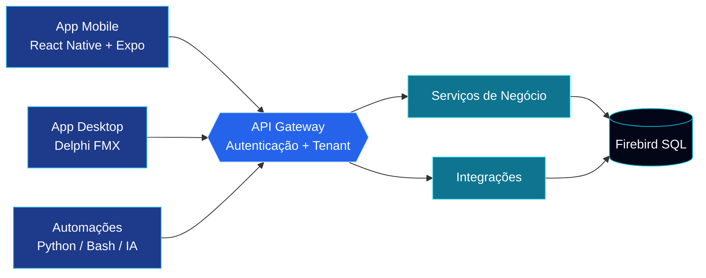
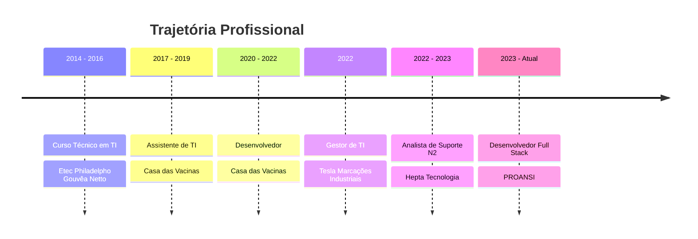
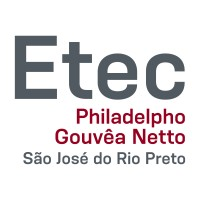

  

 

  

 

## 👤 Sobre

Desenvolvedor full stack com mais de nove anos de atuação em tecnologia, construindo e sustentando sistemas que operam em produção. Minha experiência combina **arquitetura de APIs multi-tenant**, **modernização de sistemas legados** e **desenvolvimento de aplicações mobile e desktop**, sempre com foco em qualidade de código, desempenho, escalabilidade e valor entregue ao negócio.

> **Princípios de engenharia:** código legível, decisões documentadas, mudanças incrementais e automação de tudo que for repetitivo.

 

## 🎯 Áreas de Atuação

🏗️ **Backend & Arquitetura** — projeto e desenvolvimento de APIs, modelagem multi-tenant, integrações e padronização de serviços.

📱 **Desenvolvimento Mobile** — aplicações com React Native (Expo) e NativeWind, além de soluções em Delphi FMX.

🗄️ **Banco de Dados & Legado** — Firebird SQL, otimização de consultas e refatoração incremental de sistemas legados.

⚙️ **Automação & IA** — scripts em Python e Bash, pipelines de automação e fluxos de trabalho com inteligência artificial.

🐧 **Android Customizado** — customização e build de ROMs com AOSP e LineageOS.

 

## 🧩 Arquitetura de Referência

Modelo que resume o tipo de solução em que mais atuo: clientes múltiplos consumindo uma API multi-tenant com isolamento por tenant sobre uma camada de dados legada e modernizada.

```mermaid
flowchart LR
    A[App Mobile<br/>React Native + Expo]:::client --> G
    B[App Desktop<br/>Delphi FMX]:::client --> G
    C[Automações<br/>Python / Bash / IA]:::client --> G
    G{{API Gateway<br/>Autenticação + Tenant}}:::core --> S1[Serviços de Negócio]:::svc
    G --> S2[Integrações]:::svc
    S1 --> D[(Firebird SQL)]:::data
    S2 --> D

    classDef client fill:#1e3a8a,stroke:#38bdf8,color:#ffffff
    classDef core fill:#2563eb,stroke:#bae6fd,color:#ffffff
    classDef svc fill:#0e7490,stroke:#67e8f9,color:#ffffff
    classDef data fill:#020617,stroke:#06b6d4,color:#ffffff
```

 

## 🛠️ Stack Tecnológica

**Linguagens & Frameworks**

  

**Dados, Infraestrutura & Ferramentas**

 

## 💼 Experiência Profissional

  
  <b>Desenvolvedor Full Stack</b> &nbsp; 
  <code>PROANSI</code> · jul. 2023 – presente · 3 anos 5 meses · São José do Rio Preto, SP

 

  
  <b>Analista de Suporte N2</b> 
  <code>Hepta Tecnologia e Informática</code> · out. 2022 – jun. 2023 · 9 meses · São José do Rio Preto, SP

 

  
  <b>Gestor de TI</b> 
  <code>Tesla Marcações Industriais</code> · jun. 2022 – set. 2022 · 4 meses · São José do Rio Preto, SP

 

  
  <b>Casa das Vacinas</b> &nbsp; 
  ↳ <b>Desenvolvedor</b> · jan. 2020 – jun. 2022 · 2 anos 6 meses 
  ↳ <b>Assistente de TI</b> · jan. 2017 – jan. 2020 · 3 anos 1 mês

 

<b>📈 Ver linha do tempo da carreira</b>

 

```mermaid
timeline
    title Trajetória Profissional
    2014 - 2016 : Curso Técnico em TI : Etec Philadelpho Gouvêa Netto
    2017 - 2019 : Assistente de TI : Casa das Vacinas
    2020 - 2022 : Desenvolvedor : Casa das Vacinas
    2022 : Gestor de TI : Tesla Marcações Industriais
    2022 - 2023 : Analista de Suporte N2 : Hepta Tecnologia
    2023 - Atual : Desenvolvedor Full Stack : PROANSI
```

 

## 🎓 Formação Acadêmica

  
  <b>Etec Philadelpho Gouvêa Netto</b> 
  <code>Curso Técnico Integrado em Tecnologia da Informação</code> · 2014 – 2016

 

 

## 📊 Atividade no GitHub

  

  

<picture>
  <source media="(prefers-color-scheme: dark)" srcset="https://raw.githubusercontent.com/dreyranos/dreyranos/output/github-snake-dark.svg" />
  <source media="(prefers-color-scheme: light)" srcset="https://raw.githubusercontent.com/dreyranos/dreyranos/output/github-snake.svg" />
  
</picture>

 

## 📬 Contato

Aberto a projetos, parcerias e novas oportunidades profissionais.

 

  

